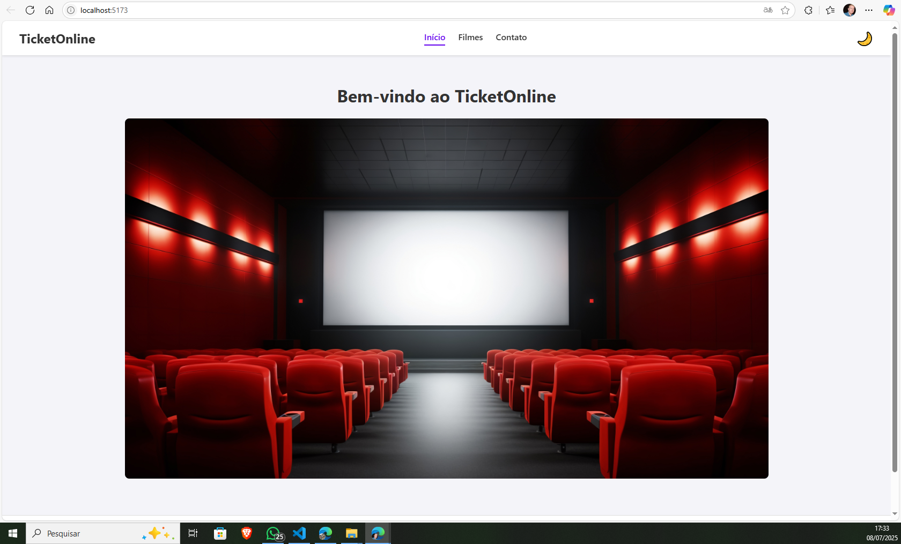

# React + TypeScript + Vite

# Ticket Online ✨

Uma Single-Page Application (SPA) para uma loja de tickets de cinema, com foco na exibição de filmes, seus detalhes e um formulário de contato. Este projeto foi desenvolvido como uma série de exercícios práticos para solidificar conceitos modernos de desenvolvimento front-end com React e TypeScript.

## 🖼️ Visualização



## 🚀 Funcionalidades Principais

  * **🎨 Tema Claro e Escuro (Light/Dark Mode):** Controle de tema global utilizando a Context API do React.
  * **🎬 Listagem de Filmes:** Exibição de um grid de filmes a partir de dados locais (mock), com informações como pôster, gênero e classificação.
  * **ℹ️ Página de Detalhes:** Visualização completa de um filme selecionado, incluindo sinopse e um botão para voltar à listagem.
  * **🧭 Roteamento Completo:** Navegação fluida entre as páginas de `Início`, `Filmes`, `Detalhes do Filme` e `Contato` utilizando React Router.
  * **📧 Formulário de Contato:** Formulário com campos obrigatórios e validação em tempo real utilizando a biblioteca React Hook Form.
  * **🧩 Arquitetura Organizada:** O projeto segue a metodologia **Atomic Design** para uma organização de componentes clara e escalável.

## 🛠️ Tecnologias Utilizadas

  * **React:** Biblioteca principal para a construção da interface.
  * **TypeScript:** Para adicionar tipagem estática e segurança ao código.
  * **Vite:** Ferramenta de build e servidor de desenvolvimento extremamente rápido.
  * **React Router DOM:** Para gerenciamento de rotas na SPA.
  * **React Hook Form:** Para criação e validação de formulários de forma performática.
  * **Context API:** Para gerenciamento de estado global (tema).
  * **Atomic Design:** Metodologia de organização de componentes.
  * **CSS:** Estilização com folhas de estilo co-localizadas e variáveis para temas.

## 📁 Estrutura do Projeto

O projeto utiliza uma estrutura de pastas baseada em **Atomic Design** para organizar os componentes de forma hierárquica e reutilizável.

```
src/
├── assets/         # CSS global, fontes, etc.
├── components/     # Componentes reutilizáveis
│   ├── atoms/      # Os menores componentes (Button, Input)
│   ├── molecules/  # Combinações de átomos (MovieCard)
│   └── organisms/  # Seções completas da UI (Navbar, MovieGrid)
├── contexts/       # Gerenciamento de estado com Context API
├── data/           # Dados simulados (mock)
├── hooks/          # Hooks customizados
├── pages/          # Componentes que representam as páginas da aplicação
└── ...
```

## 🏁 Como Executar o Projeto

Para rodar este projeto localmente, siga os passos abaixo:

1.  **Clone o repositório:**

    ```bash
    git clone https://github.com/seu-usuario/ticket-online.git
    ```

2.  **Navegue até a pasta do projeto:**

    ```bash
    cd ticket-online
    ```

3.  **Instale as dependências:**

    ```bash
    npm install
    ```

4.  **Inicie o servidor de desenvolvimento:**

    ```bash
    npm run dev
    ```

Após executar o último comando, o projeto estará disponível em `http://localhost:5173` (ou outra porta indicada no terminal).

## 📜 Scripts Disponíveis

  * `npm run dev`: Inicia o servidor de desenvolvimento com Fast Refresh (HMR).
  * `npm run build`: Gera a versão de produção otimizada do projeto na pasta `dist/`.
  * `npm run lint`: Executa o linter (ESLint) para verificar a qualidade do código.
  * `npm run preview`: Inicia um servidor local para visualizar a versão de produção (após o build).
